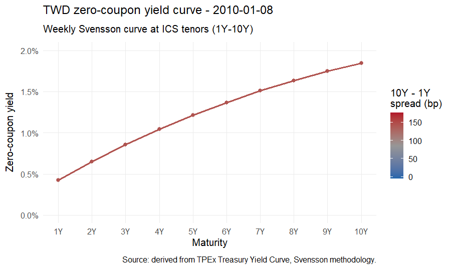
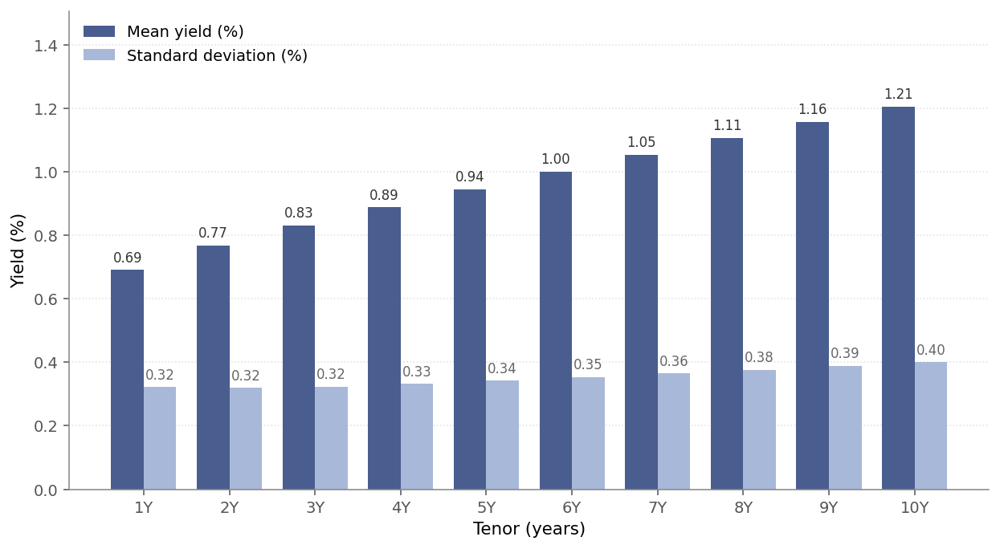
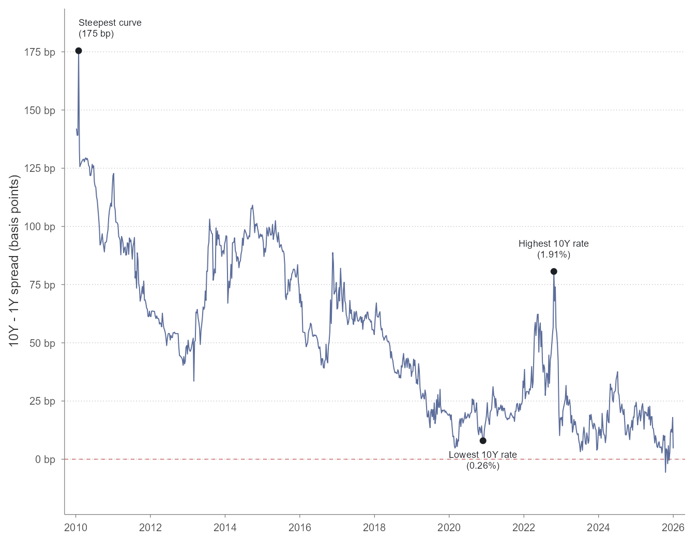

::: {.callout-note appearance="simple"}
This is the first analytical article in a series on the ICS interest rate
risk model. The series introduction, scope, disclaimers, references, and
data conventions are in [Article 0](../00-intro/index.qmd).
:::

Before introducing the model, it is worth looking at the data the model
is trying to describe. This article shows sixteen years of Taiwan's
government bond zero-coupon yield curves, summarises what those curves
have done, and points out a few specific dates that will reappear in
the later articles.

The article is descriptive. No mathematics is required to read it. The
later articles in the series will be denser, but they assume the visual
intuition built here.

## Where the data comes from

The Taipei Exchange (TPEx) publishes the daily zero-coupon yield curve
for Taiwan central government bonds at maturities from one month to
thirty years, available at:

<https://www.tpex.org.tw/en-us/bond/info/statistics-gb/day/yield.html>

TPEx provides two fitting methodologies for each day: a Cubic B-Spline
non-parametric smoothing fit and a Svensson parametric fit (an extended
form of the Nelson-Siegel curve). I use the Svensson curves throughout
this series, because Svensson is from the same parametric family as
Nelson-Siegel, which keeps the modelling framework internally consistent
when the Dynamic Nelson-Siegel model is calibrated in [Article 4](../04-dns/index.qmd).

## How the sample is constructed

To match the ICS calibration document's data specification (paragraph 88), the
sample used in this series is:

- **Frequency**: weekly observations
- **Sampling day**: last available trading day in each ISO calendar
  week --- typically Friday close, with fallback to an earlier trading
  day when Friday is a holiday
- **Tenors**: 1, 2, 3, 4, 5, 6, 7, 8, 9, 10 years --- the integer-year
  maturities listed in the ICS calibration methodology. For TWD, ICS
  specifies that 20Y and 30Y data are omitted because the Last
  Observable Term is at year 10 (see [Article 0](../00-intro/index.qmd)). As a secondary
  consideration, TPEx's Svensson curve at longer tenors is less
  reliably anchored to traded bonds, which gives an empirical reason
  to be cautious about long-tenor data even where it is reported.
- **Date range**: 8 January 2010 to 31 December 2025

This yields **824 weekly observations**, one for each ISO calendar week in the range --- 100% ISO-week coverage. Of these, 752 fall on Fridays. Earlier weekdays appear when Friday is a holiday --- most commonly during Lunar New Year week. A small number of observations fall on a Saturday: Taiwan occasionally schedules a make-up trading day on a Saturday to compensate for a weekday holiday adjacent to a long break. These are legitimate trading days and are included as such. Each of the 824 observations is a genuine TPEx-published Svensson curve; no interpolation, carry-forward, or other gap-filling was applied.

One caveat about the input data should be stated up front. The Svensson
curve is itself a parametric fit to underlying bond trade data; this
series uses the fitted curve, not raw bond prices. The ICS methodology
explicitly works with fitted zero-coupon spot rates, so this is
consistent with the regulatory specification, but readers should
understand that volatility estimates produced downstream reflect the
volatility of the *fitted* curve, not raw bond market microstructure.

## What the curve looks like, week by week

The animation below shows the full Svensson curve at the ten ICS tenors
on every weekly observation from 2010 through 2025. Each frame is one
week. The horizontal axis is maturity in years; the vertical axis is
the zero-coupon rate; the line colour reflects the slope (10-year minus
1-year spread).

{#fig-yield-animation fig-alt="Animated weekly yield curves from 2010 to 2025"}

A few things are visible from the animation that are difficult to
express any other way:

1. The curve **falls in level** roughly continuously from 2010 to 2021,
   then **rises sharply** through 2022 as Taiwan's central bank
   tightened alongside global peers.
2. The curve **shape** is mostly upward-sloping with modest curvature,
   but the slope flattens markedly around 2019 and again in late 2024.
3. The curve is **never strongly inverted** in this tenor range. The
   1Y--10Y spread crosses zero in only three weeks of the sample, and
   the deepest inversion is about six basis points.

Static charts can show one or two of these features at a time. The animation shows all three at once.

## Summary statistics

The table below summarises the level, dispersion, and range of yields
at each of the ten ICS tenors, computed across the 824 weekly
observations.

:::{style="max-width: 100%;max-height: 400px; overflow-x: auto;"}

| Tenor    | Mean   | Std Dev | Min    | 5th pct | Median | 95th pct | Max    |
|----------|--------|---------|--------|---------|--------|----------|--------|
| 1 year   | 0.691% | 0.322%  | 0.042% | 0.219%  | 0.635% | 1.350%   | 1.452% |
| 2 year   | 0.768% | 0.319%  | 0.138% | 0.248%  | 0.759% | 1.387%   | 1.485% |
| 3 year   | 0.831% | 0.323%  | 0.148% | 0.273%  | 0.867% | 1.418%   | 1.526% |
| 4 year   | 0.888% | 0.332%  | 0.173% | 0.300%  | 0.981% | 1.447%   | 1.644% |
| 5 year   | 0.944% | 0.342%  | 0.189% | 0.326%  | 1.042% | 1.474%   | 1.727% |
| 6 year   | 1.000% | 0.353%  | 0.205% | 0.346%  | 1.093% | 1.494%   | 1.787% |
| 7 year   | 1.054% | 0.365%  | 0.219% | 0.368%  | 1.126% | 1.531%   | 1.832% |
| 8 year   | 1.107% | 0.377%  | 0.233% | 0.388%  | 1.170% | 1.592%   | 1.865% |
| 9 year   | 1.157% | 0.388%  | 0.244% | 0.408%  | 1.217% | 1.656%   | 1.892% |
| 10 year  | 1.205% | 0.400%  | 0.255% | 0.420%  | 1.264% | 1.727%   | 1.913% |

: Summary statistics by tenor across 824 weekly observations, 2010-01-08 to 2025-12-31. Source: derived from TPEx Treasury Yield Curve data (Svensson methodology). {#tbl-summary-stats}
:::

A few observations from the table:

- The 10-year rate has not exceeded 1.91% in this sample. For an insurance industry that historically priced guaranteed-return products off rate assumptions well above this, the implications for in-force books are significant.
- Mean yields rise nearly linearly across tenors from 0.69% at 1Y to 1.21% at 10Y. The standard deviation also rises with tenor, from 0.32% to 0.40% --- longer tenors are modestly more volatile in absolute terms.
- The dispersion within any single tenor (standard deviation of around 0.3%--0.4%) is comparable to the dispersion across tenors at any single date (10Y mean minus 1Y mean is 0.51%). This means level shifts and slope shifts are both first-order drivers of curve variation. Neither dominates the other. [Article 2](../02-pca/index.qmd) quantifies the share of variation attributable to level vs. slope vs. curvature movements via principal component analysis, and compares the PC loadings to the Nelson-Siegel basis functions.

The pattern in standard deviation across tenors is more nuanced than it first appears. Although absolute volatility rises with tenor, the *coefficient of variation* --- standard deviation divided by mean --- falls with tenor, from 0.466 at 1Y to 0.332 at 10Y. In other words, short rates fluctuate proportionally more around their mean than long rates do. This is the empirical signature of a curve anchored at the long end and pinned to monetary policy at the short end: short rates are pulled around by policy and inflation surprises, while long rates reflect a slower-moving expectation of where the economy settles. The DNS framework in [Article 4](../04-dns/index.qmd) captures this asymmetry by allowing different volatilities on the level and slope factors.

| Tenor   | Mean   | Std Dev | Coefficient of Variation |
| ------- | ------ | ------- | ------------------------ |
| 1 year  | 0.691% | 0.322%  | 0.466                    |
| 2 year  | 0.768% | 0.319%  | 0.416                    |
| 3 year  | 0.831% | 0.323%  | 0.389                    |
| 4 year  | 0.888% | 0.332%  | 0.373                    |
| 5 year  | 0.944% | 0.342%  | 0.362                    |
| 6 year  | 1.000% | 0.353%  | 0.353                    |
| 7 year  | 1.054% | 0.365%  | 0.346                    |
| 8 year  | 1.107% | 0.377%  | 0.340                    |
| 9 year  | 1.157% | 0.388%  | 0.336                    |
| 10 year | 1.205% | 0.400%  | 0.332                    |

: Coefficient of variation (standard deviation divided by mean) by tenor, weekly observations 2010-01-08 to 2025-12-31. {#tbl-coef-var}

The same level-and-volatility pattern is easier to read off a chart than from the table. Mean rates rise smoothly across tenors, while standard deviations rise more slowly and remain in a narrow band.

{#fig-mean-std-tenor fig-alt="Bar chart showing mean yield and standard deviation increasing with tenor"}

### Cross-Tenor Correlations

Beyond the summary statistics of individual tenors, understanding how yields move together is critical. The tables below show the correlation of yield levels and the correlation of weekly yield changes across the tenors.

:::{style="max-width: 100%;max-height: 400px; overflow-x: auto;"}
| Tenor | 1 year | 2 year | 3 year | 4 year | 5 year | 6 year | 7 year | 8 year | 9 year | 10 year |
|-------|------|------|------|------|------|------|------|------|------|-------|
| 1 year | 1.0000 | 0.9821 | 0.9397 | 0.8855 | 0.8286 | 0.7735 | 0.7219 | 0.6748 | 0.6325 | 0.5953 |
| 2 year | 0.9821 | 1.0000 | 0.9864 | 0.9544 | 0.9141 | 0.8714 | 0.8292 | 0.7892 | 0.7524 | 0.7191 |
| 3 year | 0.9397 | 0.9864 | 1.0000 | 0.9902 | 0.9673 | 0.9378 | 0.9057 | 0.8732 | 0.8418 | 0.8126 |
| 4 year | 0.8855 | 0.9544 | 0.9902 | 1.0000 | 0.9931 | 0.9764 | 0.9542 | 0.9295 | 0.9042 | 0.8795 |
| 5 year | 0.8286 | 0.9141 | 0.9673 | 0.9931 | 1.0000 | 0.9949 | 0.9823 | 0.9653 | 0.9462 | 0.9264 |
| 6 year | 0.7735 | 0.8714 | 0.9378 | 0.9764 | 0.9949 | 1.0000 | 0.9961 | 0.9865 | 0.9734 | 0.9585 |
| 7 year | 0.7219 | 0.8292 | 0.9057 | 0.9542 | 0.9823 | 0.9961 | 1.0000 | 0.9970 | 0.9896 | 0.9795 |
| 8 year | 0.6748 | 0.7892 | 0.8732 | 0.9295 | 0.9653 | 0.9865 | 0.9970 | 1.0000 | 0.9977 | 0.9920 |
| 9 year | 0.6325 | 0.7524 | 0.8418 | 0.9042 | 0.9462 | 0.9734 | 0.9896 | 0.9977 | 1.0000 | 0.9983 |
| 10 year | 0.5953 | 0.7191 | 0.8126 | 0.8795 | 0.9264 | 0.9585 | 0.9795 | 0.9920 | 0.9983 | 1.0000 |

: Correlation matrix of yield curve levels across tenors. {#tbl-corr-levels}
:::

As expected, yields of adjacent tenors are highly correlated in levels, often exceeding 0.98. The correlation decays as the distance between tenors increases, but even the 1-year and 10-year yield levels maintain a correlation of roughly 0.60.

:::{style="max-width: 100%;max-height: 400px; overflow-x: auto;"}
| Tenor | 1 year | 2 year | 3 year | 4 year | 5 year | 6 year | 7 year | 8 year | 9 year | 10 year |
|-------|------|------|------|------|------|------|------|------|------|-------|
| 1 year | 1.0000 | 0.9087 | 0.6730 | 0.4442 | 0.3044 | 0.2347 | 0.2057 | 0.1991 | 0.2042 | 0.2150 |
| 2 year | 0.9087 | 1.0000 | 0.9087 | 0.7399 | 0.6093 | 0.5304 | 0.4881 | 0.4688 | 0.4632 | 0.4653 |
| 3 year | 0.6730 | 0.9087 | 1.0000 | 0.9497 | 0.8706 | 0.8070 | 0.7632 | 0.7346 | 0.7167 | 0.7051 |
| 4 year | 0.4442 | 0.7399 | 0.9497 | 1.0000 | 0.9792 | 0.9442 | 0.9117 | 0.8845 | 0.8622 | 0.8425 |
| 5 year | 0.3044 | 0.6093 | 0.8706 | 0.9792 | 1.0000 | 0.9906 | 0.9724 | 0.9523 | 0.9318 | 0.9104 |
| 6 year | 0.2347 | 0.5304 | 0.8070 | 0.9442 | 0.9906 | 1.0000 | 0.9948 | 0.9830 | 0.9673 | 0.9482 |
| 7 year | 0.2057 | 0.4881 | 0.7632 | 0.9117 | 0.9724 | 0.9948 | 1.0000 | 0.9963 | 0.9867 | 0.9718 |
| 8 year | 0.1991 | 0.4688 | 0.7346 | 0.8845 | 0.9523 | 0.9830 | 0.9963 | 1.0000 | 0.9968 | 0.9874 |
| 9 year | 0.2042 | 0.4632 | 0.7167 | 0.8622 | 0.9318 | 0.9673 | 0.9867 | 0.9968 | 1.0000 | 0.9967 |
| 10 year | 0.2150 | 0.4653 | 0.7051 | 0.8425 | 0.9104 | 0.9482 | 0.9718 | 0.9874 | 0.9967 | 1.0000 |

: Correlation matrix of weekly yield curve changes across tenors. {#tbl-corr-changes}
:::

When looking at weekly changes, the correlations are naturally lower but still exhibit a strong positive relationship, particularly among adjacent tenors. This comovement is what allows models like the Nelson-Siegel framework to effectively capture curve dynamics using a small number of factors.

## The slope: 10-year minus 1-year spread

A useful one-dimensional summary of the curve is the slope, here
defined as the 10-year rate minus the 1-year rate. Over the weekly
sample:

- Mean spread: 51.4 basis points
- Median spread: 49.3 basis points
- Standard deviation: 33.2 basis points
- Maximum: 175.5 basis points
- Minimum: −5.6 basis points

The spread was negative on 3 of 824 weekly observations (0.4% of the
sample), and the deepest inversion was about six basis points. Taiwan
has effectively not experienced a meaningful curve inversion in this
period --- a contrast worth noting against US Treasuries, which
inverted substantially over the same window.

{#fig-slope-timeseries fig-alt="Time series of 10Y minus 1Y spread"}

## A few dates worth knowing

Specific dates from the sample will reappear in the later articles when the calibration and stress scenarios are discussed. All three dates below are weekly observations in the 824-week sample described above, not daily extrema; the daily TPEx series contains slightly more extreme values on nearby business days, but those days do not fall on the ISO-week sampling boundary used for this series. The most useful to fix in mind:

**Lowest 10-year rate observed**: 0.255% on 27 November 2020. This was
the trough of the post-COVID low-rate regime. The full curve that week
was extremely flat --- the 1-year rate was approximately 0.18%, meaning
roughly 8 basis points of slope across the entire 1-to-10-year range.

**Highest 10-year rate observed**: 1.913% on 21 October 2022. This was
near the peak of the 2022 tightening cycle.

**Steepest curve observed**: the 1Y--10Y spread reached 175.5 basis
points on 29 January 2010, when short rates were at their cyclical
lows (the 1-year rate hit its sample minimum of 0.042% the same week)
but long rates had not yet declined.

**Annual averages of the 10-year rate** illustrate the broader
structure of the sample:

:::{style="max-width: 100%;max-height: 400px; overflow-x: auto;"}
| Year | Mean 10Y rate |
|------|---------------|
| 2010 | 1.64%         |
| 2011 | 1.54%         |
| 2012 | 1.32%         |
| 2013 | 1.49%         |
| 2014 | 1.64%         |
| 2015 | 1.46%         |
| 2016 | 0.97%         |
| 2017 | 1.17%         |
| 2018 | 1.01%         |
| 2019 | 0.76%         |
| 2020 | 0.46%         |
| 2021 | 0.45%         |
| 2022 | 1.23%         |
| 2023 | 1.21%         |
| 2024 | 1.50%         |
| 2025 | 1.45%         |

: Annual mean of the 10-year zero-coupon rate. Source: derived from TPEx Treasury Yield Curve data (Svensson methodology), weekly sample. {#tbl-annual-10y}

:::

The bimodal shape of the distribution of the 10-year rate makes the regime structure visible at a glance. Roughly 28% of weekly observations sit below 1%, concentrated in the 2019--2021 low-rate window; the bulk of the sample sits in the 1.2%--1.7% range, drawn from 2010--2014 and from 2022 onward.

{#fig-y10-dist fig-alt="Histogram of 10-year zero-coupon rate showing bimodal distribution"}

The 10-year rate spent approximately three years (2019--2021) below 1%, returned to roughly its 2010 level by 2024, and has been broadly stable since. The DNS model that this series calibrates in [Article 4](../04-dns/index.qmd) will treat the full sixteen-year window as one stationary process; whether that is a reasonable treatment, given the visible regime structure, is a question worth coming back to once the model has been estimated. The ICS calibration specification (paragraph 88) requires using the full window starting 1 January 2010; whether the regime structure visible here violates the stationarity assumption implied by that specification is a question [Article 5](../05-kalman/index.qmd) will return to.

## What this looks like inside the modelling framework

Three observations from this article carry directly into the next ones:

- Yields move together across tenors, but not identically. Both level and shape change over time. [Article 2 (PCA)](../02-pca/index.qmd) quantifies how much of the variation lies in each direction.
- Volatility increases with tenor in absolute terms. The model in [Article 4 (DNS framework)](../04-dns/index.qmd) allows different factors to have different volatilities, which is consistent with this observation.
- The data covers a low-rate regime, a tightening cycle, and a
  post-tightening reset. [Article 5](../05-kalman/index.qmd) (Kalman calibration) estimates
  a single set of mean-reversion and volatility parameters across all
  three sub-periods; the appropriateness of that assumption is worth
  flagging now and revisiting then.

The next [article](../02-pca/index.qmd) begins the analytical work proper, with a principal
component decomposition of the dataset shown here.

---

*This article is part of a series. The series introduction and
disclaimers are in [Article 0](../00-intro/).
Comments and corrections welcome.*
