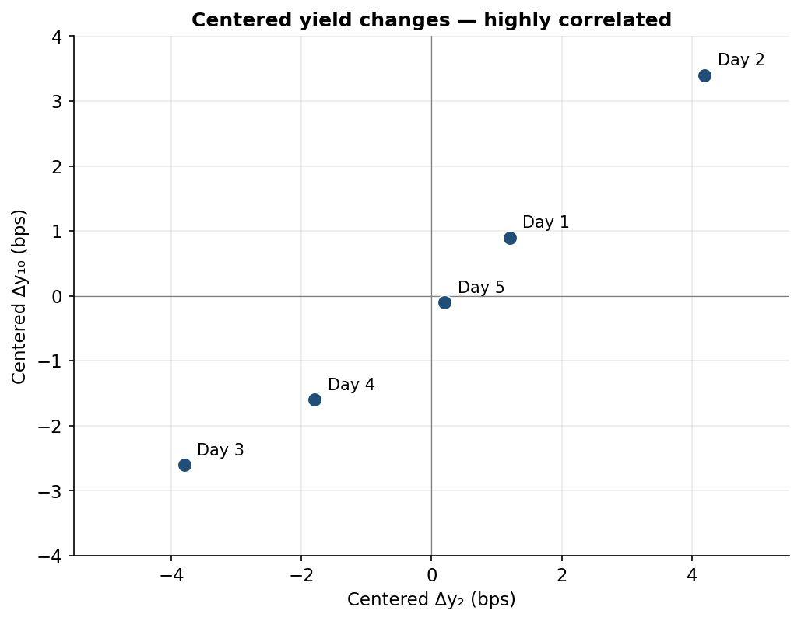
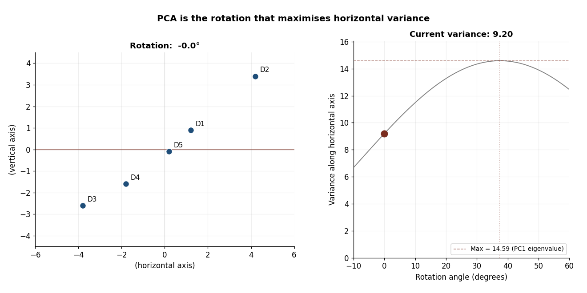

Principal component analysis is one of the standard tools used to decompose yield curve movements into a small number of independent factors. On real yield curve data with ten or more tenors, the procedure typically delivers a Level / Slope / Curvature decomposition that accounts for roughly 95% of variance. The mechanism is described in many places; the canonical reference is @litterman1991.

This article does not work on a real yield curve. It works on a deliberately small example --- two tenors, five days, fabricated numbers chosen so that every value is reproducible by hand. The point is to fix the mechanics of the method in a setting where every intermediate quantity can be drawn on a single page. With two tenors, the data lives in the plane; the rotation that PCA performs is a literal rotation, and the eigenvectors are literal axes.

A two-tenor, five-day example has real limitations, and the limitations matter for what readers should and should not take away. They are stated explicitly in [§ 2D limitations](#sec-caveat) below before the stress-scenario construction. The mechanism shown here extends without modification to ten or sixty tenors; the *interpretation* of components beyond the first is what changes when more tenors are available.

## The raw data

The example uses five days of observed daily changes (in basis points) on two hypothetical tenors, a "2-year" and a "10-year":

| Day   | Δy₂ (bps) | Δy₁₀ (bps) |
|-------|-----------|------------|
| Day 1 | 2.0       | 1.5        |
| Day 2 | 5.0       | 4.0        |
| Day 3 | −3.0      | −2.0       |
| Day 4 | −1.0      | −1.0       |
| Day 5 | 1.0       | 0.5        |

: Five days of yield changes (fabricated data). {#tbl-raw}

The sample means are 0.80 bps on the 2-year and 0.60 bps on the 10-year. PCA operates on deviations from the mean, so the first step is to subtract these:

| Day   | Centered Δy₂ | Centered Δy₁₀ |
|-------|--------------|---------------|
| Day 1 | 1.2          | 0.9           |
| Day 2 | 4.2          | 3.4           |
| Day 3 | −3.8         | −2.6          |
| Day 4 | −1.8         | −1.6          |
| Day 5 | 0.2          | −0.1          |

: Mean-centered yield changes. Each column sums to zero. {#tbl-centered}

Centering matters because variance is measured relative to the mean. PCA finds the directions of maximum variance; if the data is not centered, the first principal component will point partly toward wherever the mean happens to sit rather than toward the direction of greatest variability.

## The data is highly correlated

Plotting the centered data on a scatter shows the central problem PCA is built to address. The five points lie nearly on a straight line: a day with a large move in the 2-year is almost always a day with a large move in the same direction in the 10-year. The sample correlation is approximately 0.99.

{#fig-before-pca fig-alt="Scatter plot of centered 2-year vs 10-year daily yield changes showing near-perfect linear relationship"}

This is the condition that makes independent stress testing on the original variables unrealistic. A scenario like "+5 bps to the 2-year, 0 to the 10-year" lies far off the cloud of observed joint behaviour and would imply a yield curve geometry the sample never produced. PCA addresses this by finding new axes --- rotated relative to the original ones --- along which the data is uncorrelated by construction.

## Extracting the principal components

The sample covariance matrix (using the n − 1 = 4 denominator, matching R's `cov()` and `prcomp()` defaults) is:

$$
\Sigma = \begin{bmatrix} 9.20 & 7.025 \\ 7.025 & 5.425 \end{bmatrix}
$$

Solving the characteristic equation det(Σ − λI) = 0 gives two eigenvalues and two corresponding eigenvectors:

| Component | Eigenvalue | Eigenvector              | Variance share |
|-----------|------------|--------------------------|----------------|
| PC1       | 14.587     | [0.7936, 0.6085]         | 99.74%         |
| PC2       | 0.038      | [−0.6085, 0.7936]        | 0.26%          |

: Eigendecomposition of the sample covariance matrix. {#tbl-eig}

PC1 points in the direction (0.79, 0.61) --- roughly along the 45° line where the 2-year and 10-year move together. This is naturally interpreted as the **Level** factor: a positive PC1 score corresponds to both yields moving up together.

PC2 points in the direction (−0.61, 0.79), perpendicular to PC1. The 2-year and 10-year move in opposite directions along it. With only two tenors, this can be informally read as **Steepness**, with the caveat covered in [§ 2D limitations](#sec-caveat).

The 99.74% / 0.26% split is an artefact of this toy. The two tenors here are nearly collinear in this 5-day sample, so almost all variance is captured by the first component. On real yield curves with ten or more tenors, PC1 typically explains 70–90% of variance, PC2 a further 5–15%, and PC3 around 1–5%. Reporting "PC1 explains 99.7%" as a general fact about yield curves would be misleading; it is a fact about this toy.

Two conventions affect reproducibility. Eigenvectors are defined up to sign, so software may return (−0.79, −0.61) instead of (0.79, 0.61); the two are the same direction and the choice does not change any downstream analysis. The convention adopted here is that PC1's first loading is positive. The covariance estimator uses the n − 1 denominator throughout, matching R's defaults; `numpy.cov` requires `ddof=1` to match.

## PCA as a rotation

The eigendecomposition above is correct but somewhat abstract. There is a more concrete geometric reading: **PCA is the rotation of the data that maximises the variance along one axis.** Starting from the raw centered data and rotating progressively, the variance along the horizontal axis grows until it reaches a maximum at one specific angle. That angle is the angle of PC1; the maximum value is the PC1 eigenvalue.

{#fig-rotation-sequence fig-alt="Six-panel figure showing the centered data rotated by 0, 7.5, 15, 22.5, 30, and 37.5 degrees, with variance along the horizontal axis growing from 9.20 to 14.59"}

The angle of PC1 from the original 2-year axis is arctan(0.6085 / 0.7936) ≈ 37.48°. Rotating by exactly this angle aligns the long spine of the data cloud with the horizontal axis, leaving only the small residual spread perpendicular to it. The terminal variance of 14.59 in the right-most panel is exactly the PC1 eigenvalue: the eigenvalue *is* the variance along the principal direction.

The same process can be shown as an animation. The data rotates continuously while a tracking dot moves along the variance-vs-angle curve on the right; the dot reaches its peak at 37.48° and falls back as the rotation continues past the optimum.

{#fig-rotation-animation fig-alt="Animated GIF showing yield change data rotating continuously while variance along the horizontal axis traces out a curve with a maximum at the PC1 angle"}

The visualisation uses one shortcut for readability: the data points are shown rotating while the page-frame stays fixed. The mathematically clean statement is the reverse --- the data stays fixed and the *axes* rotate to align with it. The two views are equivalent.

## The PCA scores

Projecting each day's centered observation onto the two eigenvectors gives the **PCA scores**: the coordinates of each day in the new, rotated coordinate system.

| Day   | PC1 (Level) | PC2 (Steepness) |
|-------|-------------|-----------------|
| Day 1 | 1.500       | −0.020          |
| Day 2 | 5.402       | 0.143           |
| Day 3 | −4.598      | 0.249           |
| Day 4 | −2.402      | −0.174          |
| Day 5 | 0.098       | −0.198          |

: PCA scores. Each row is one day's coordinates in the (PC1, PC2) system. {#tbl-scores}

The PC1 column ranges from −4.60 to +5.40 --- about ten basis points of spread. The PC2 column ranges from −0.20 to +0.25 --- about half a basis point of spread. This twenty-fold scale difference is the 99.74%-vs-0.26% variance split rendered in the data.

A direct verification of one row: for Day 1, PC1 = 1.2 × 0.7936 + 0.9 × 0.6085 = 1.500, and PC2 = 1.2 × (−0.6085) + 0.9 × 0.7936 = −0.020.

The before-and-after scatter makes the rotation visible in a single image. Side by side, the correlated raw data and the uncorrelated scores are easy to compare:

{#fig-before-after fig-alt="Side-by-side comparison: left panel shows correlated raw data, right panel shows uncorrelated PCA scores"}

Day 5 is worth a sentence on its own. Its raw change was (+1.0, +0.5) bps --- both yields rose. But that change was very close to the average daily move in the sample, (+0.8, +0.6). So in the *centered* frame, Day 5 shows almost no level movement. What residual movement remained was a slight twist: the 2-year rose marginally more than its average while the 10-year rose marginally less. PC2 captures exactly that. Inspection of the raw yields would not have flagged Day 5 as a structurally unusual day; the PC2 column does.

## 2D limitations {#sec-caveat}

Two facts about this toy example need explicit statement before any of the apparatus is interpreted too literally.

First, PCA on two variables can only ever produce two components. The famous Level / Slope / Curvature decomposition of @litterman1991 requires at least three maturities to surface. Curvature is structurally absent from this article. The label "Steepness" applied to PC2 here is a useful intuition pump --- a 2-vs-10 spread is genuinely related to the slope of a yield curve --- but it is not the same object as the second principal component that emerges from a full multi-maturity decomposition. On a real ten-tenor dataset, PC2 exhibits a sign pattern that is clearly identifiable as slope (short tenors load with one sign, long tenors with the other), and PC3 exhibits the characteristic curvature pattern (the middle tenors loading opposite to the ends). None of that can be demonstrated here.

Second, this article works on yield *changes*, not yield *levels*. The distinction matters. Levels are highly persistent: PC1 of yield levels tends to capture "where on average yields are sitting" rather than "how they move." Stress testing requires the second concept. The Litterman--Scheinkman decomposition, and virtually all regulatory frameworks built on it, operate on changes.

## Reverse construction: building stress scenarios

The forward use of PCA goes from raw yield changes to PCA scores. The reverse use goes from a hypothetical PC score back to a yield change, by projecting the score along the eigenvector and adding the sample mean:

$$
\text{Stressed change} = \text{Mean} + (\text{Shock magnitude}) \times \text{Eigenvector}
$$

In risk frameworks the shock magnitude is calibrated in standard deviations of the relevant principal component. The standard deviations are the square roots of the eigenvalues:

- 1 SD of PC1 = √14.587 ≈ 3.819 bps
- 1 SD of PC2 = √0.038 ≈ 0.196 bps

PC1's standard deviation is roughly nineteen times PC2's. This is not an external choice; it is a property of the data, telling the modeller automatically that level shifts are much larger than pure twists historically.

The "1 SD" choice here is for illustration. Real regulatory frameworks use higher percentiles --- Solvency II uses 99.5% one-year Value-at-Risk, which corresponds to roughly 2.58 standard deviations under a Gaussian assumption. The mechanism is identical; only the multiplier changes.

### Scenario A: a level shock (+1 SD on PC1)

Shocking PC1 by +1 SD (3.819) and holding PC2 at zero simulates a coherent upward shift of the curve that respects the historical correlation between the 2-year and 10-year.

| Tenor   | Mean change (bps) | PC1 impact (bps)         | Stressed change (bps) |
|---------|-------------------|--------------------------|-----------------------|
| 2-Year  | 0.80              | 3.819 × 0.7936 = 3.031   | 3.831                 |
| 10-Year | 0.60              | 3.819 × 0.6085 = 2.324   | 2.924                 |

: Scenario A: +1 SD shock on PC1. {#tbl-scenario-a}

Both yields rise, in approximately the historical ratio of co-movement. This is a statistically coherent "parallel up" scenario --- one that the joint distribution of the historical sample would not consider improbable on geometric grounds.

### Scenario B: a steepness shock (+1 SD on PC2)

Shocking PC2 by +1 SD (0.196) and holding PC1 at zero isolates a pure curve twist.

| Tenor   | Mean change (bps) | PC2 impact (bps)            | Stressed change (bps) |
|---------|-------------------|-----------------------------|-----------------------|
| 2-Year  | 0.80              | 0.196 × (−0.6085) = −0.119  | 0.681                 |
| 10-Year | 0.60              | 0.196 × 0.7936 = 0.155      | 0.755                 |

: Scenario B: +1 SD shock on PC2. {#tbl-scenario-b}

The 2-year rises slightly less than its mean while the 10-year rises slightly more. The 10-vs-2 spread widens by roughly 0.27 bps relative to the unstressed baseline --- a mild steepening.

The asymmetry between Scenario A and Scenario B is the point of the exercise. A "1 SD" shock to Level produces about 3 bps of yield movement; the same "1 SD" shock to Steepness produces about 0.15 bps. The framework recognises --- without being told --- that level shifts are historically large and pure twists are historically small. This is the role of the eigenvalues: they convert the abstract idea of a "one-standard-deviation shock" into the right scale for each factor.

## What carries to the real-data setting

Three observations from this toy carry directly into PCA on real, multi-tenor yield curve datasets.

- PCA finds independent factors from correlated data by rotating the coordinate system. The mechanism is identical at any dimensionality; what changes is how many components are needed to capture most of the variance.
- The eigenvalues are not just diagnostic numbers; they automatically provide the scale at which each factor can be plausibly shocked. This is what makes PCA useful for stress generation, not only descriptive analysis.
- The interpretation of PC1 as Level survives the move from two tenors to ten or more. The interpretation of PC2 as Slope and PC3 as Curvature requires the full multi-tenor dataset to demonstrate; the 2D toy cannot show it.

## Further reading

@litterman1991 is the seminal paper introducing PCA to fixed-income portfolios and identifying the Level / Slope / Curvature decomposition.
@hull2018risk covers Value at Risk and historical simulation, including step-by-step numerical examples of the covariance-to-eigenvalue-to-stress-scenario workflow used here. 
@tuckman2022fixed has chapters on empirical risk metrics that show how asset-liability management desks use PCA to measure portfolio sensitivity to twists and butterfly shifts. 
@alexander2008market gives the explicit matrix-algebra implementation of PCA in finance.

---

*Source code for the figures in this article is available
[in the repo](https://github.com/kelvin1189/actuarial-modeling-notes/tree/main/posts/pca-toy/code).*

Comments and corrections welcome.
